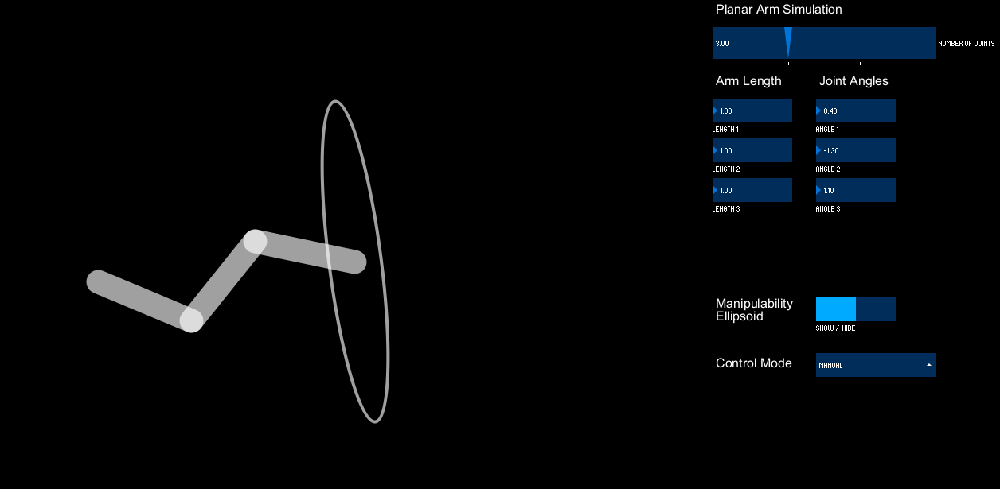

# planar-arm

# Planar Arm Simulation

This project simulates a planar robotic arm using Processing. The simulation allows you to control the number of joints, segment lengths, and joint angles of the arm. It also includes features for visualizing the arm's movement and manipulability ellipsoid.

## Features

- Adjustable number of joints (2 to 5)
- Control over segment lengths and joint angles
- Visualization of the manipulability ellipsoid
- Different update logics: Manual, Null Space, Random

## Installation

To run this simulation, you need to install Processing, ControlP5, and EJML.

### Install Processing

1. Download and install Processing from the [official website](https://processing.org/download/).

### Install ControlP5

1. Open Processing.
2. Go to `Sketch` > `Import Library` > `Add Library`.
3. Search for `ControlP5` and install it.

### Install EJML

1. Download the EJML library from the [official website](http://ejml.org/wiki/index.php?title=Download).
2. Place the downloaded EJML JAR files in the `ArmSimulation/code` directory of this project.

## Run the Simulation

1. Open `ArmSimulation/ArmSimulation.pde` in Processing.
2. Click the `Run` button to start the simulation.
